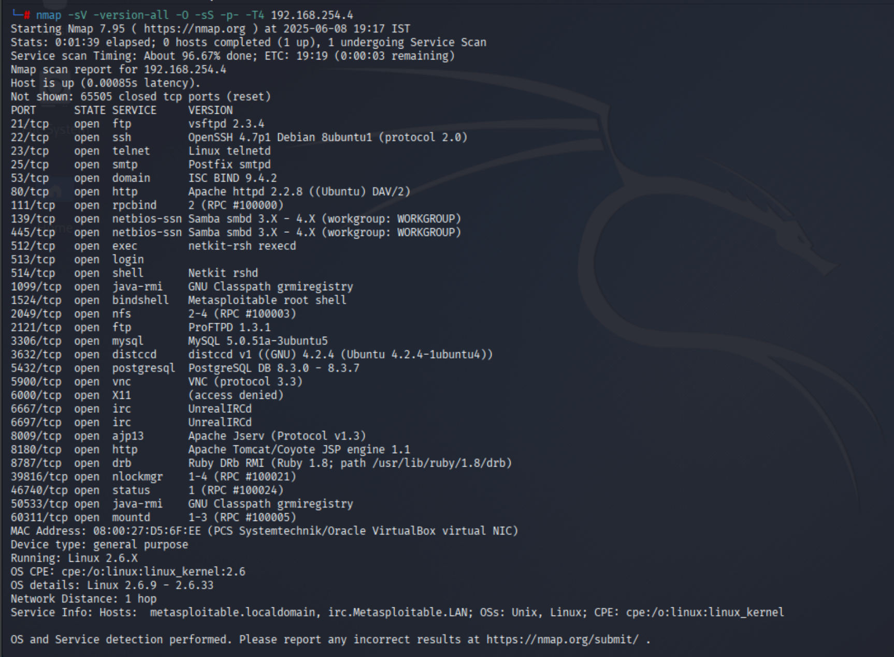

# Metasploitable2-vuln-lab

Metasploitable2 Vulnerable Lab is designed to show how one can detect and attack common vulnerabilities in Metasploitable 2. The lab deals with testing different open ports and services, which helps learners recognize real attacks and become better ethical hackers. 


## Lab Setup & Configuration

To get started with the Metasploitable2 Vulnerable Lab, make sure you have the following:

- **Metasploitable 2 VM**: Download and import the Metasploitable 2 virtual machine from the official source.
- **Penetration Testing Platform**: Kali Linux (recommended) or other security-focused distros like Parrot OS, BlackArch, or custom setups with Metasploit Framework, Nmap, Burp Suite, and other essential pentesting tools.
- **Network Configuration**: Ensure both your attacker machine (Kali) and Metasploitable 2 VM are on the same network or subnet for connectivity.
- **Basic Tools Installed**:
  - Nmap (for port scanning)
  - Metasploit Framework (for exploiting vulnerabilities)
  - Other tools like Hydra, Netcat, or Wireshark as needed.
- **Virtualization Software**: Such as VMware Workstation, VirtualBox, or any compatible hypervisor.


## Port Scanning

To begin the assessment, a thorough port scan was performed on the Metasploitable 2 target using the following Nmap command:

```bash
nmap -sV --version-all -O -sS -p- -T4 <target-ip>
```
This Nmap command is used to perform a detailed scan of the target machine to discover open ports, running services, and the operating system. Here's what each option means:

- `-sV`: Detects the version of services running on open ports.  
- `--version-all`: Requests a thorough version detection for more accurate results.  
- `-O`: Enables operating system detection.  
- `-sS`: Performs a stealthy TCP SYN scan to quickly find open ports without completing the TCP handshake.  
- `-p-`: Scans all 65,535 TCP ports instead of the default top 1,000 ports.  
- `-T4`: Uses a faster timing template for quicker scan execution while maintaining accuracy.

####  Reconnaissance Output   

  


## Exploitation

This section provides details and summaries of the exploits performed against various vulnerable services on the Metasploitable2 machine.

---

###  FTP (Port 21)

- **Service**: vsftpd 2.3.4 (Very vulnerable FTP server)
- **Exploit Discovery**: Used `msfconsole` to search for available Metasploit modules targeting vsftpd.
  
  ```bash
  msf6 > search vsftpd

---

### Telnet (Port 23)

- **Method**: Manual login brute-force
- **Tool Used**: `hydra` with custom `userpass_file`
- **Credentials Found**: `msfadmin:msfadmin`
- **Result**: Shell access via Telnet

---

### SMB/Samba (Ports 139/445)

- **Service**: Samba smbd 3.x
- **Exploit Used**: `exploit/multi/samba/usermap_script`
- **Payload**: `cmd/unix/reverse`
- **Result**: Reverse shell as root
- **Notes**: Vulnerable to usermap script command execution

---

### distccd (Port 3632)

- **Exploit Used**: `exploit/unix/misc/distcc_exec`
- **Payload**: `cmd/unix/reverse`
- **Result**: Reverse shell as daemon user
- **Notes**: Classic remote command execution via distcc service
